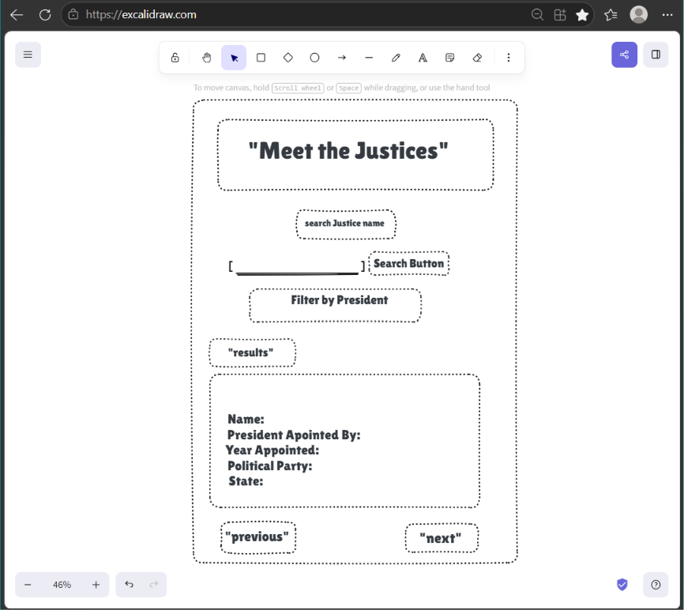

	# Meet the Justices
	
	## The problem
	A student needs to find trends in Supreme Court justice appointments because they want to understand how the Court has changed over time. My page will help them explore justices by state president, and years of service.

	## The plan

	

	### Sections
	Overview - A brief introduction explaining the purpose of the app and what the users can explore.
	Search and Filters (President,State, Years of Service)
	Results & Trends
	
	### User input
	A dropdown menu to select a president.
	A dropdown menu to select a state.
	A text box for years of service.
	A button to display results.
	
	
	### Outputs
	Name
	President appointed By
	Year Apointed
	Political Party
	State

	## Data
	
	US Supreme Court Justices
	
	id,Justice number,Image,Justice,Year of birth,State,Position,Succeeded,Date confirmed,Tenure length,Nominated by
1,1.0,https://upload.wikimedia.org/wikipedia/commons/7/72/John_Jay_%28Gilbert_Stuart_portrait%29.jpg,John Jay,1745.0,NY,ChiefJustice,Inaugural,"September 26, 1789","5 years, 253 days",George Washington

	1. Which president nominated the most Supreme Court justices?
	
	2. Which state has produced the most Supreme Court justices?
	
	3. Who served the longest tenure on the Supreme Court?
	
	

	## Team
	
	Accountability partner: TammyAlbinDev