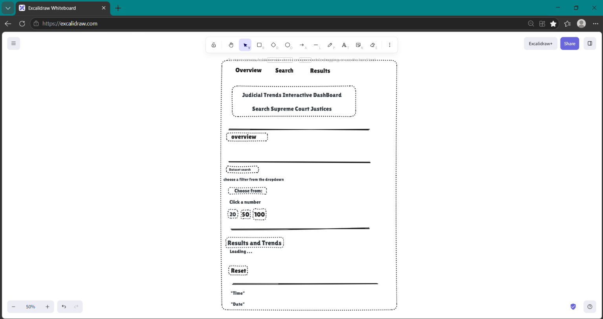

[README.md](https://github.com/user-attachments/files/32772129/README.md)[Uploading 	#Judicial Trends Interactive Dashboard: Search Supreme Court Justices
	
	## The problem
	A student needs to find trends in Supreme Court justice appointments because they want to understand how the Court has changed over time. My page will help them explore justices by state president, and years of service.

	## The plan
	
	The original plan continues. What has changed is the Title and the wireframe. The page has working dropdown boxes and a text input search box. My original wireframe did not function properly when put into HTML, so, that is why the entire wireframe is refreshed. Since the last commit, I have completed the app. The app functions with its respected DOM opperators. The API shows its results in its section.

	## The plan

	

	
	### Sections
	Overview - A brief introduction explaining the purpose of the app and what the users can explore.
	Search and Filters (Nominated By, State, Date Confirmed)
	Results & Trends
	
	### User input
	A dropdown menu to select a filter.
	Buttons to choose the amount of data to display.
	A reset button in results and trends.
	
	### Outputs
	Nominated By
	State
	Date Confirmed

	## Data
	
	US Supreme Court Justices
	
	id,Justice number,Image,Justice,Year of birth,State,Position,Succeeded,Date confirmed,Tenure length,Nominated by
	
	1,1.0,https://upload.wikimedia.org/wikipedia/commons/7/72/John_Jay_%28Gilbert_Stuart_portrait%29.jpg,John Jay,1745.0,NY,ChiefJustice,Inaugural,"September 26, 1789","5�years, 253�days",George Washington

	1. Who nominated the first Supreme Court justice?

	2. Which state produced the first Supreme Court justice?
	
	3. Which president was confirmed first?
	
	

	## Team
	
	Accountability partner: TammyAlbinDev

		
